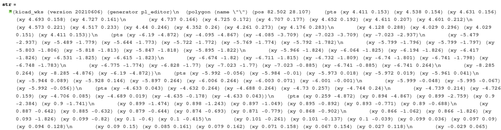
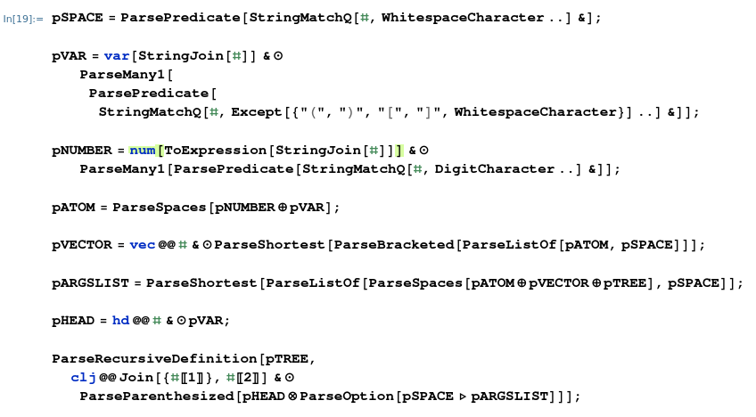
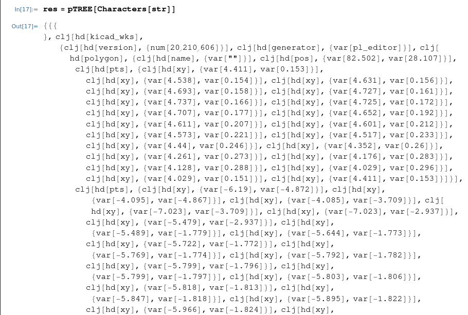
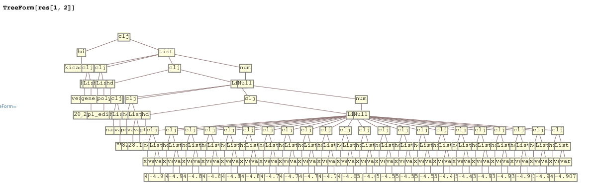

# Kicad File S-Expression Parser 

This is a set of scripts (part of my Circuit Compass project) that unravels clojures from
Kicad files. Kicad expression compilation is not implemented as it stands, I needed this for
something work related. 

## Working Demo: 

